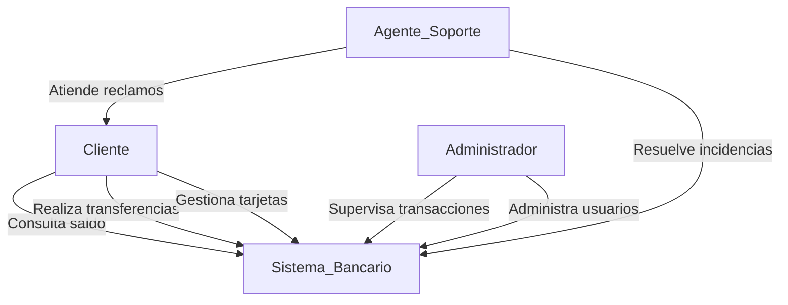

# Actores del Sistema

## Introducción

Este documento describe los actores del sistema bancario y sus interacciones con la plataforma German.

## Lista de Actores

### 1. Cliente

**Descripción:** Usuario final que utiliza la aplicación bancaria para realizar operaciones financieras.  
**Responsabilidades:**

- Consultar saldo y movimientos.
- Realizar transferencias y pagos.
- Gestionar tarjetas y cuentas.

### 2. Administrador

**Descripción:** Usuario con privilegios avanzados para gestionar la plataforma y supervisar operaciones.  
**Responsabilidades:**

- Administrar usuarios y permisos.
- Monitorear transacciones y detectar fraudes.
- Generar reportes financieros.

### 3. Agente de Soporte

**Descripción:** Personal encargado de brindar asistencia a los clientes y resolver incidencias.  
**Responsabilidades:**

- Atender consultas y reclamos.
- Gestionar disputas de transacciones.
- Brindar soporte técnico sobre el uso de la aplicación.

### 4. Sistema Bancario

**Descripción:** Plataforma tecnológica que gestiona todas las operaciones del banco.  
**Responsabilidades:**

- Procesar y validar transacciones.
- Mantener la integridad y seguridad de los datos.
- Comunicarse con otros sistemas financieros.

## Diagrama de Actores

