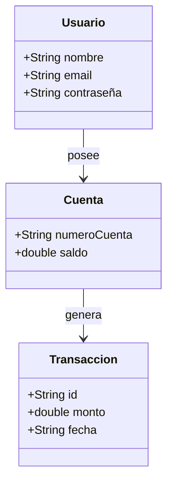

# Diagrama de Clases

```mermaid
classDiagram
  class Usuario {
    +String nombre
    +String email
    +String contraseña
  }
  class Cuenta {
    +String numeroCuenta
    +double saldo
  }
  class Transaccion {
    +String id
    +double monto
    +String fecha
  }
  Usuario --> Cuenta : posee
  Cuenta --> Transaccion : genera
```
